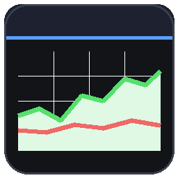

<div align="center">



# SkyQuant

**A clean, modern, interactive price-graph overlay for Hypixel SkyBlock — in-game, without the blocky vanilla-Minecraft UI.**

[skyquant.dev](https://skyquant.dev) · Powered by the [Coflnet SkyBlock API](https://sky.coflnet.com/)

</div>

---

Most SkyBlock price mods bolt numbers onto item tooltips. **SkyQuant** instead gives you a **floating, draggable, freely-resizable graph panel** you can throw anywhere on screen: hover the line to scrub exact values at any moment, switch time ranges, pin several items side by side, and read the Bazaar / Auction House numbers that actually matter for flipping.

> Not affiliated with Coflnet or Hypixel. Price & history data comes from the community Coflnet API.

## Features

- **Interactive graph panel** — draggable, resizable to any size (drag the bottom-right corner), pinnable. Open as many as you like.
- **Hover to scrub** — a crosshair shows the exact timestamp, buy/sell (or price), and **margin** at the moment under your cursor.
- **Bazaar view** — insta-buy / insta-sell, buy & sell volume, active buy orders / sell offers, **current + average margin**, liquidity (est. items/day), NPC sell price.
- **Auction view** — lowest BIN plus **2nd / 3rd** lowest and how many are listed, sold median, period low/high, recent sold volume, NPC sell price.
- **5 time ranges** — 1d / 1w / 1mo / 6mo / 1y, with a true time-based axis (young items leave the earlier period blank instead of stretching).
- **Live** — auto-refreshes (default every 30s) with an "updated Xs ago" / "stale" indicator, and shared rate-limiting so it stays polite to the API.
- **Compact mode** — drag a window short and it collapses to a graph-only view with the name overlaid.
- **Hover explanations** — hover any metric label to see what it means.
- **Item coverage** — resolves pets, enchanted books, and runes to the right market tag.
- Remembers your open windows across sessions.

## How to use

- **Hover an item in any inventory / chest / AH / Bazaar GUI and press `Y`** (rebindable in Options → Controls) to open its graph.
- **`/graph <item>`** (alias `/watch <item>`) — open the graph for any item by name, with tab autocomplete. Works even when no GUI is open.
- **Lookup** button (in a window's title bar) fires Hypixel's own `/bz` / `/ahsearch` to open the in-game listing.
- Drag the title bar to move; drag the bottom-right corner to resize; title-bar buttons: compact, pin, Lookup, close.

## Requirements

- Minecraft **26.1.2** (Fabric)
- [Fabric API](https://modrinth.com/mod/fabric-api)
- [Cloth Config](https://modrinth.com/mod/cloth-config)
- [Mod Menu](https://modrinth.com/mod/modmenu) *(optional — for the settings screen)*

## Configuration

Open **Mod Menu → SkyQuant** (or edit `config/skyquant.json`): default range, refresh interval, remember-windows, and per-line toggles for every detail row so you can declutter the header.

## Building from source

```bash
./gradlew build
# output: build/libs/skyquant-<version>.jar
```

## Credits

- Price, history & item data: **[Coflnet](https://sky.coflnet.com/)** SkyBlock API.
- Item id resolution informed by [SkyHanni](https://github.com/hannibal002/SkyHanni) and the [NEU item repo](https://github.com/NotEnoughUpdates/NotEnoughUpdates-REPO).

## License

[MIT](LICENSE) © 2026 Senne Visser
